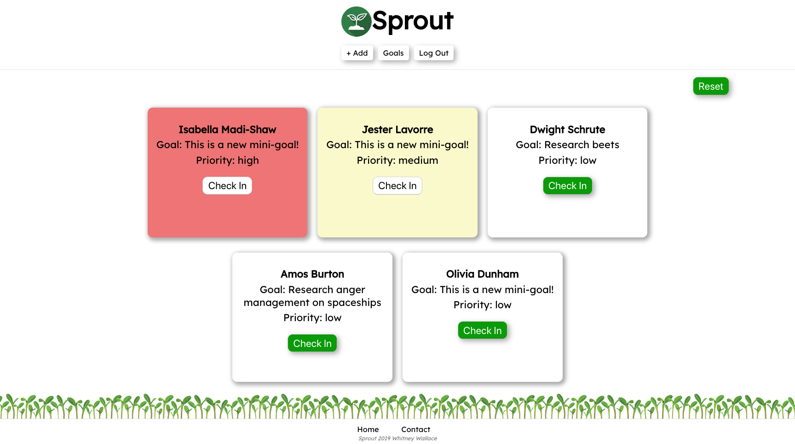

# Sprout

GitHub Repo: [Sprout Client](https://github.com/WhitneySamWallace/Sprout-Client/blob/master/README.md)

## Motivation:
Every day teachers are striving to give their students specific, timely, and goal-oriented feedback to adhere to teaching best practices and nurture the understanding of their students.  

With the increasing pressures of curriculum, standardized testing, and behavior management - Sprout is built to help teachers organize their feedback, set specific goals for each student, and give reminders to check back in a timely manner.  Right now, Sprout focuses on elementary school classrooms.

#### Live Link: [Sprout App](https://sprout-capstone-1.whitneysamwallace.now.sh/)

## Summary:
Sprout helps teachers give their students specific, timely, and goal-oriented feedback.  Sprout lets teachers add students from their class (right now only supports one class, multiple class support in the works).  Each student is displayed on a card along with their current goal and goal priority.  By clicking the `Check In` button, the card expands and allows teachers to update the student's goal and set a new priority.  

All priorities have a timer attached.  Currently `high priority` goals alert the teacher to check back in after `5 minutes`.  `Medium priority` goals expire in `10 minutes`, and `low priority` in `20 minutes`.  These are set timers for now, customizable timers are in the works.

## Demo Account:
See what Sprout has to offer by using these login credentials:

### *`Username: Teacher1`*
### *`Password: Teacher1pass!`*

## Screenshots:

### *Landing Page*
- Introduction to Sprout with Navigation bar and link to Sign Up

- Information on the motivations for Sprout

- Login information for accessing the Sprout Demo

- Sign up section that will automatically redirect to the Main view on successful sign up

## *Login*
- Allows users to log in and routes to Main view on successful log in.

## *Main*
- The Main view welcomes the user, has a Navigation bar that now has links to `+Add`, `Goals`, and `Log Out`.

- The Main view displays all current students along with current student goals and priorities, and has a `Reset` button.

- When the user clicks `Check In` the student card expands and prompts the user to add a new mini-goal and select a priority.

- When the user is having a student `Check In`, the previous goal and priority persist so the user can conference with the student about their progress and then submit a new goal by entering the goal and priority, then pressing `Update`.

- When the user clicks `Update` the student card collapses and a timer starts depending on the selected priority.  The student remains in their original list order until the timer expires.

- Once the priority timer expires, the student card is moved to the top of the list and color coded according to the goal priority.  

- When multiple student cards have reached expiration, the first student card to reach expiration will always remain first in the list.  Cards will all be color coded according to goal priority, regardless of order.

- When the user wants to complete a follow-up `Check in` with a student, they click the `Check In` button and are met with the familiar goal-setting expanded card.

- Once a new goal is set, the student card returns to it's original non-expired location while waiting for the new timer to expire.

- `Check Ins` can occur in any order and is up to user discretion.  `Checking In` with a student that is not first, will not affect the positioning of any student cards before or after that are waiting for a `Check In`.

- If the user decides the student does not require a follow-up `Check In`, they can click `Cancel` and the student will be returned to their non-expired list location.

- If the user wishes to reset all goals and priorities at the same time, they may click the `Reset` button.  Currently this is a client-side only data manipulation.  If the user does not perform a `Check In` with every student that has been `Reset`, that student card will default to their previous goal upon reload/re-log in.  This prevents loss of goal data.

## AddStudent

- If the user clicks the `+Add` navigational button, they will route to the `AddStudent` view.

- A user can add a name by typing the student name and clicking `Add`.

- The new student will be added to the student list.  Students can also be deleted by clicking the corresponding `Delete` button.

- When a new student is added, a new student card will appear on the `Main` view

## API Documentation:
`/api/students`
  - GET -> Gets all students that belong to specific user id (Requires Auth)
  - POST -> Inserts new student into database (Requires Auth)

`/api/students/:studentId`
  - DELETE -> Removes student from database (Requires Auth)
  - PATCH -> Updates student in database (Requires Auth)

`/api/auth/login`
  - POST -> Compares to users in database, if matching creates and sends JWT token

`/api/auth/refresh`
  - POST -> Refreshes JWT token

`/api/users`
  - POST -> Adds user to database

## Technology/Frameworks Used:
- HTML
- CSS
- JavaScript
- React
- Jest
- Express
- Node.js
- PostgreSQL
- Knex
- Mocha, Chai & Supertest

- Zeit Now
- Heroku
- Git
- Github
- Visual Studio Code
- DBeaver
- Postman

## Installation:
### [Sprout Server](https://github.com/WhitneySamWallace/Sprout-Server)
- Install dependencies: `npm install`
- Create development and test databases: `createdb sprout`, `createdb sprout-test`
- Create database user: `postgres`
- Grant privileges to new user in `psql`:
  - `GRANT ALL PRIVILEGES ON DATABASE sprout TO postgres`
  - `GRANT ALL PRIVILEGES ON DATABASE sprout-test TO postgres`
- Prepare environment file: `cp exmaple.env .env`
  - Replace values in `.env` with your custom values if necessary.
- Bootstrap development database: `MIGRATION_DB_NAME=sprout npm run migrate`
- Bootstrap test database: `MIGRATION_DB_NAME=sprout-test npm run migrate`
- To seed the database for development: `psql -U postgres -d sprout -f ./seeds/seed.sprout_users.sql` and `psql -U postgres -d sprout -f ./seeds/seed.sprout_students.sql`
- Start the server for development: `npm run dev`

### [Sprout Client](https://github.com/WhitneySamWallace/Sprout-Client)
- Install dependencies: `npm install`
- Start the application for development: `npm start`

## Credits:
Created by Whitney Wallace 
- [Portfolio](https://thinkful-ei-emu.github.io/portfolio-whitney/)
